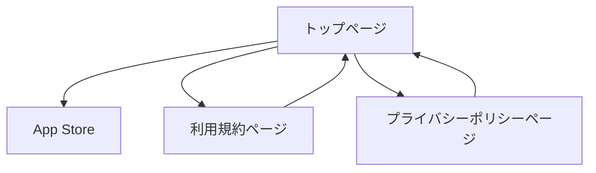

# Blurry ランディングページ 要件定義書

## 1. Product Overview
Blurry - Hide your faceアプリの公式ランディングページサイト。自動顔隠し機能を持つiOSアプリの紹介とダウンロード促進を目的とする。
- App Storeでの認知度向上とダウンロード数増加を目指す
- プライバシー保護に関心のあるユーザーをターゲットとした訴求

## 2. Core Features

### 2.1 User Roles
役割の区別は不要。すべての訪問者が同等にアクセス可能。

### 2.2 Feature Module
ランディングページサイトは以下の主要ページで構成されます：
1. **トップページ**: ヒーローセクション、アプリ紹介、機能説明、ダウンロードリンク
2. **利用規約ページ**: 多言語対応の利用規約表示
3. **プライバシーポリシーページ**: 多言語対応のプライバシーポリシー表示

### 2.3 Page Details

| Page Name | Module Name | Feature description |
|-----------|-------------|---------------------|
| トップページ | ヒーローセクション | アプリロゴ、キャッチコピー、App Storeダウンロードボタンを配置 |
| トップページ | アプリ紹介セクション | アプリの主要機能（自動顔隠し、ワンクリック保存、簡単編集）を説明 |
| トップページ | スクリーンショットギャラリー | App Storeのスクリーンショットを表示してアプリの使用感を伝える |
| トップページ | フッター | 利用規約・プライバシーポリシーへのリンク、言語切り替え |
| 利用規約ページ | 利用規約表示 | 日本語・英語対応の利用規約テキスト表示、言語切り替え機能 |
| プライバシーポリシーページ | プライバシーポリシー表示 | 日本語・英語対応のプライバシーポリシーテキスト表示、言語切り替え機能 |

## 3. Core Process

**一般ユーザーフロー**
1. トップページにアクセス
2. アプリの機能を確認
3. App Storeダウンロードボタンをクリックしてアプリをダウンロード
4. 必要に応じて利用規約・プライバシーポリシーを確認

## 4. User Interface Design

### 4.1 Design Style
- **プライマリカラー**: 紫系（#8B5CF6）- アプリアイコンに合わせた色調
- **セカンダリカラー**: 白（#FFFFFF）、グレー（#6B7280）
- **ボタンスタイル**: 角丸のモダンなデザイン
- **フォント**: システムフォント（-apple-system, BlinkMacSystemFont）、16px基準
- **レイアウト**: シンプルなカード型レイアウト、中央寄せデザイン
- **アイコン**: シンプルなライン系アイコン

### 4.2 Page Design Overview

| Page Name | Module Name | UI Elements |
|-----------|-------------|-------------|
| トップページ | ヒーローセクション | 大きなアプリアイコン、白背景にグラデーション、中央配置のCTAボタン |
| トップページ | アプリ紹介セクション | 3カラムのカードレイアウト、各機能にアイコンと説明文 |
| トップページ | スクリーンショットギャラリー | 横スクロール可能なiPhoneモックアップ表示 |
| 利用規約ページ | 利用規約表示 | シンプルなテキストレイアウト、右上に言語切り替えボタン |
| プライバシーポリシーページ | プライバシーポリシー表示 | シンプルなテキストレイアウト、右上に言語切り替えボタン |

### 4.3 Responsiveness
モバイルファーストのレスポンシブデザイン。タッチ操作に最適化されたボタンサイズとレイアウト。