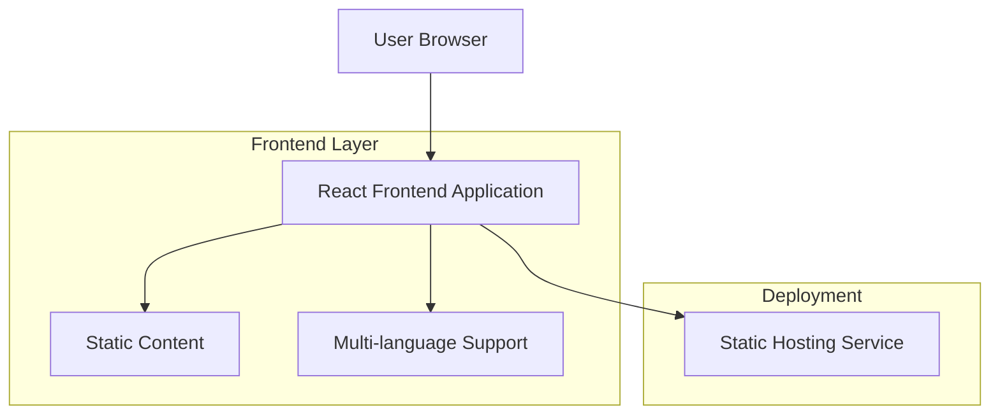

# Blurry ランディングページ 技術アーキテクチャ文書

## 1. Architecture design



## 2. Technology Description

- Frontend: React@18 + tailwindcss@3 + vite + react-i18next
- Backend: None（静的サイト）

## 3. Route definitions

| Route | Purpose |
|-------|----------|
| / | トップページ、アプリの紹介とダウンロードリンク |
| /terms | 利用規約ページ、多言語対応 |
| /privacy | プライバシーポリシーページ、多言語対応 |

## 4. API definitions

APIは使用しません。すべて静的コンテンツとして配信されます。

## 5. Server architecture diagram

サーバーサイドの処理はありません。静的サイトとして配信されます。

## 6. Data model

### 6.1 Data model definition

データベースは使用しません。多言語対応はJSONファイルによる静的な翻訳データで実現します。

### 6.2 Data Definition Language

データベースは使用しないため、DDLはありません。

多言語対応用の翻訳データ構造例：

```json
{
  "ja": {
    "hero": {
      "title": "Blurry - 顔を自動で隠すアプリ",
      "subtitle": "プライバシーを守りながら、写真を安心してシェア",
      "downloadButton": "App Storeでダウンロード"
    },
    "features": {
      "autoBlur": {
        "title": "自動顔認識",
        "description": "AIが自動で顔を検出してぼかし処理"
      }
    }
  },
  "en": {
    "hero": {
      "title": "Blurry - Hide your face automatically",
      "subtitle": "Share photos safely while protecting privacy",
      "downloadButton": "Download on App Store"
    },
    "features": {
      "autoBlur": {
        "title": "Auto Face Detection",
        "description": "AI automatically detects and blurs faces"
      }
    }
  }
}
```